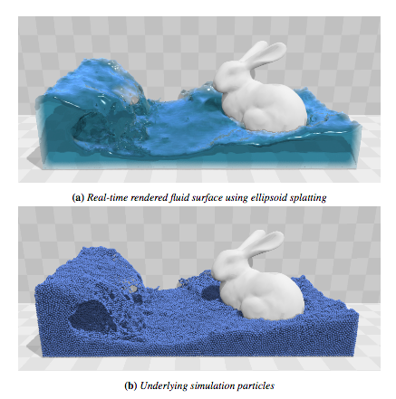

## CS 184: Computer Graphics and Imaging, Spring 2018

### 3D Position Based Fluid Simulation and Surfacing

Gauthier Dieppedalle (24362705), Utkarsh Singhal (25674685), YiDing Jiang (25551317)

**Summary**

In this project, we plan to implement the **[position based fluids](http://mmacklin.com/pbf_sig_preprint.pdf)** from Nvidia. The particle simulation will include various properties such as viscosity, surface tension and we will also implement surfacing (surface reconstruction) with OpenGL/Mitsuba. If time permits, we want to try machine learning techniques for accelerating the particle simulation.

**Problem Description**

Fluid simulation is an interesting topic that has many important applications in computer graphics. We are interested in producing photo realistic simulation of water and understanding the underlying physics of water; therefore, we think particle based simulation is an ideal candidate. It is important to have physically realistic simulation of water because many engineering applications require accurate simulations that reflect the actual physical interaction. The main challenges of this task are: 

1. The algorithm is mathematically involved
2. The simulation requires efficient data strucutre for neighbor finding
3. The simulation must be numerically stable
4. Machine learning would be interesting and potentially challenging if we do use it

We will first try to replicate the paper and then build on top of the paper if we have sufficient time.

**Goal and Deliverables**

1. **What we plan to deliver**

This effect is our goal for replicating the paper. The bottom shows the particle simulation and the top shows the surfacing result plus or minus the bunny. We plan to measure the quality of the simulation by visually inspecting the realism of the simulation and also comparing the result to the paper. Then, we plan to measure the performance of the system by measuring the runtime as a function of the number of particles. We also want to explore different parameters for both simlation and surfacing.

We want to explore the tradeoff curve for number of particles vs. runtime vs. render quality. We are also interested in how to better parametrize the system for machine learning.

2. **What we hope to deliver**

We want to investigate the possible use of machine learning in fluid simulation task. In particular, we are interested in accelerating the simulation by estimating the acceleration of each particle directly via either a regression tree or a neural network.

**Schedule**

1. 04/08/2018 
   - Setting up the infrastructures for the project
   - Finish collision detection and nearest neighbor data strucuture
   - Finish basic visualization for debugging
2. 04/15/2018
   - Make progress on surfacing
   - Finish implementing various helper functions $$C$$ for enforcing the imcompressibility constraints and kernel function $$W$$
   - Create helper function for tensile instability and vorticity confinement
3. 04/22/2018
   - Finish the update loop
   - Finish surfacing
   - Debug
4. 04/29/2018
   - Add machine learning for acceleration if all goes well
   - Performance profiling
   - Create rendering and prepare for presentation

##### **Project Status Update** **(Checkpoint)**

During the last three weeks of the project, we successfully implemented the paper Position-Based fluids, and we are currently working on implementing  a) surfacing,  and b) ML-based acceleration. 

We decided to structure our project based on the Cloth Simulator. To this end, we implemented our own particle class with properties like position, velocity, viscosity etc. We also implemented each of the necessary functions to apply the fluid simulation constraints described in the paper. These functions are called in the main simulate() loop, where the properties of various particles are adjusted iteratively. Since the method relies heavily on finding the nearest neighbors for every particle, and since a grid-hash is extremely inefficient for large particle radii, we used FLANN (a KDtree implementation) to perform our nearest neighbors search. Once we have computed the neighbors, we use this information to compute various quantities like incompressibility correction, vorticity confinement adjustment etc. These adjustments are applied to the particles (along with collision detection) to simulate the fluid. We found the simulation to be very sensitive to equation parameters, so these parameters are now loaded in through the scene JSON file using a modified version of the parsing code that was already available in Cloth Simulator.  This allows us to change parameters of the simulation without re-compiling the code.

We heavily modified the OpenGL part of the cloth simulator project to make it compatible with our project. Instead of using spheres like Clothsim, we are instead using OpenGL particles, and to save on the computation, we use instancing. To make debugging easier, we also implemented a function that changes particle color based on its properties like speed, position etc. Another useful function that we implemented colors a particle's neighbors. We are also currently implementing a collisionObject for general polygons. This will let us read in arbitrary obstacles, and we will be able to collide the water with objects like bunny, spheres, and much more.

For surfacing, we wrote a function to voxelize the particles and binarize this information to pass on to Mitsuba (an open source raytracer). We hoped to use Fluid rendering capabilities in Mitsuba for rendering water by simply passing it as a volume object, but we found the results to be unsatisfactory.  To fix this, we are currently implementing marching-cubes to reconstruct the water surface and use that for our renders. We hope to finish soon after the midterm. So far we are on track with our original plan, and we hope to proceed exactly in accordance to the plan.

**Future Progress**

For the last part of the project, we plan to use Machine Learning techniques to accelerate the simulation. Our inspiration for this project is the paper about [Fluid Simulation using Regression Forests](https://www.inf.ethz.ch/personal/ladickyl/fluid_sigasia15.pdf), but since our implementation is based on Position-based Fluids paper, the quantities that we are using are not directly compatible with the ML paper. Currently we are exploring ways to combine the strengths of both papers without having to re-write significant parts of the code. In the worst case, our plan is to simply use a convolutional neural network that predicts the particle trajectory from K nearest neighbors as the input. We believe that we will be able to get significant speed gains due to the parallelization and by replacing the iterative solver with a single feed-forward step. Our final pipeline will use Tensorflow C++ API to simulate the fluid, Marching Cubes implementation to do the surfacing, and Mitsuba to raytrace the final result that looks like water. 

**Link to ACM SIGGRAPH paper CS284A:** <https://drive.google.com/file/d/18qJBAjaSd3tmXc8yFNyI21eGS17npt0S/view?usp=sharing>

**Slides:**

 <https://docs.google.com/presentation/d/1WFHYo0yR2pkavF79elH-taTa5xkzhFRqttoH_YvyOIA/edit?usp=sharing>

**Video:**

 [https://youtu.be/GPTqNQEA31k](https://youtu.be/GPTqNQEA31k)

**Resources**

[Position Based Fluids](http://mmacklin.com/pbf_sig_preprint.pdf)

[Surfacing](https://www.cc.gatech.edu/~turk/my_papers/sph_surfaces.pdf)

[Machine learning for fluid](https://www.inf.ethz.ch/personal/ladickyl/fluid_sigasia15.pdf)

[Other resources](http://blog.mmacklin.com/position-based-fluids/)

For software, we plan to used OpenGL and Mitsuba. For hardware, we want to use the hive and a laptop with 970M if needed. Tensorflow also has native C++ API.
