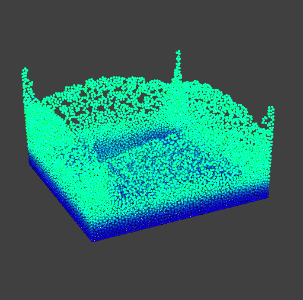
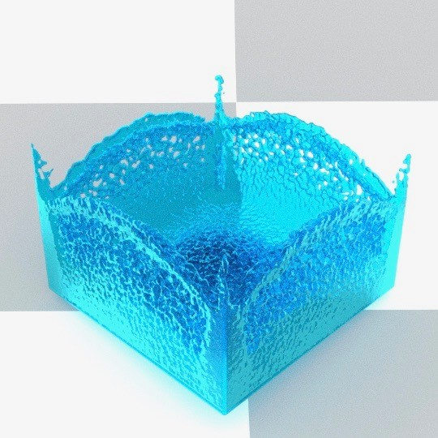
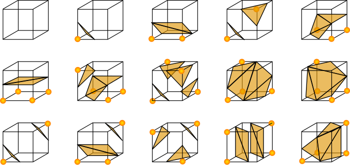
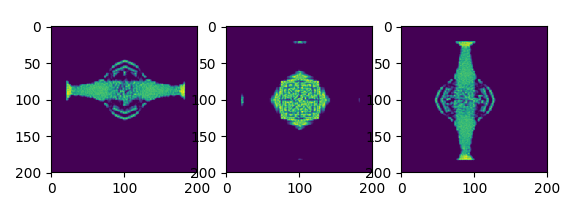
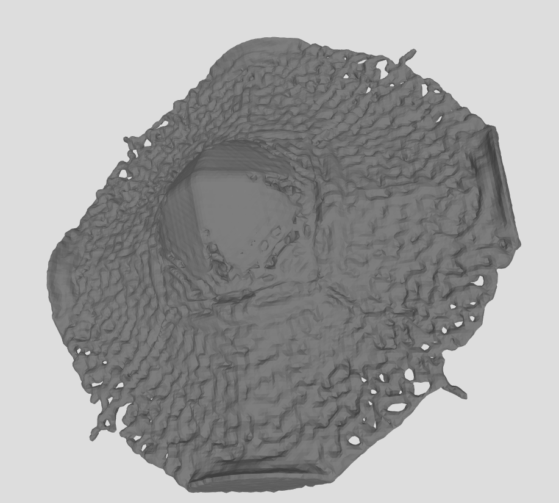

## CS 184: Computer Graphics and Imaging, Spring 2018

### Final Project: 3D Position Based Fluid Simulation and Surfacing

​		
Gauthier Dieppedalle (24362705), Utkarsh Singhal (25674685), YiDing Jiang (25551317)

|  |  |
| :----------------------------------------------------------: | :----------------------------------------------------------: |

 <iframe width="560" height="315" src="https://www.youtube.com/embed/srIHLMpww1I?rel=0" frameborder="0" allow="autoplay; encrypted-media" allowfullscreen></iframe>

 <a href="https://drive.google.com/drive/folders/12_noDACiIxFVr_rQaQvokfxu8xE5oaHe">portal to 284A report </a> 

### **Abstract**

Fluid simulation is an interesting topic that has many important applications in computer graphics. We are interested in producing photo realistic simulation of water and understanding the underlying physics of water. Over the course of the past month, we have implemented the Position Based Fluids paper written by Nvidia by Macklin et al. to simulate the particles of a fluid. Then, we reconstructed the mesh representing the surfaces of the particle-based fluid using isotropic kernels and render the mesh with path tracing. Lastly, we attempted to use a deep learning techniques to accelerate the simulation step.

### **Technical Approach**

##### Particle-based Fluid Simulation

The core component of the project is position-based simulation of water particles. Our software architecture for this part uses a similar structure as project 4 Cloth Simulator. Class ``Fluid`` is a class that serves as the abstraction for the fluid simulated and it owns all the ``Particle`` struct in the scene. Each ``Particle`` has with properties like position, velocity, viscosity etc. We implemented all functions used for evaluating the parameters needed and also the simulation steps as faithfully as the paper. Since the method heavily relies on efficient neighbor finding data structure, we find that using the naive grid hashing approach unsatisifiable so we used an external library FLANN that implements KD tree, whcih allows us to find neighbors more efficient neighbor look up. Once we have computed the neighbors, we use this information to compute various quantities like **incompressibility correction, vorticity confinement adjustment** etc. These adjustments are applied to the particles (along with collision detection) to simulate the fluid. We found that the hyperparameters of the equations affect the effect of simulation significantly so these parameters are now loaded in through the scene JSON file using a modified version of the parsing code that was already available in Cloth Simulator.  This allows us to change parameters of the simulation without re-compiling the code.

**Incompressibility correction**

This constraint aims to keep the incompressible property of the fluid (water in particular). $$\rho_o$$ is the desired density of the fluid and $$\rho_i$$ is the estimated local density around particle $i$  . Furthermore, the isotropic kernel function is defined as $$W(r, h) = \frac{315}{64 \cdot \pi \cdot h^9} (h^2-|r|^2)^3$$ where $$h$$ is the radius of the kernel and $$r$$ is the distance between 2 points.

$$\rho_i$$ is estimated with the standard SPH density estimator:

​						
		$$\rho_i = \sum_j m_j W(p_i - p_j, h)$$  

where $$m_j = 1$$ for all particle,  $$p_i$$ is the position of the particle $$i$$, and $$h$$ is the radius over which the neighbor search is done. This summation is over all neighbor particle $j$ within raidus $$h$$. Once the density estimate is calculated, the incompressibility constraint is computed as:

​							
		$$C_i = \frac{\rho_i}{\rho_o} - 1$$

The total constraint is $C= \sum_i C_i$. The goal of the update is to find a $$\Delta p$$ for  each particle such that  $$C(p+\Delta p) =0 $$ . A solution that satisfies this constraint can be approximated by $$ \Delta p \approx \nabla C(p) \lambda $$ . We can solve for $$\lambda$$ using Newton's step:

​	
	$$C(p+\Delta p) \approx C(p) + \nabla C^T \Delta p \Leftrightarrow  C(p) + \nabla C^T \Delta p = 0 \Leftrightarrow  C(p) + \nabla C^T \nabla C \lambda = 0 \Leftrightarrow \lambda=\frac{-C_p}{\nabla C^T \nabla C}$$

The gradient from the constraint function is computed as:

​				
$$\nabla_{p_k}C_i = \frac{1}{\rho_0} \sum_j \nabla_{p_k}W(p_i-p_j, h) \text{ if } k=i;           -\frac{1}{\rho_0}\nabla_{p_k}W(p_i-p_j, h) \text{ if } k=j   $$

Putting everything together, we have:

​								
	$$\lambda_i=-\frac{C_i(p_1,...,p_n)}{\sum_k |\nabla _{p_k}C_i|^2 + \epsilon}$$ 

where $$\epsilon$$ is a constant that prevents the constraints blowing up from instability. Putting everything together, the position update to each individual particle is:

​							
	$$    \Delta p_i = \frac{1}{\rho_0}\sum_j(\lambda_i + \lambda_j + s_{corr}) \nabla W(p_i-p_j, h)$$

In addition to the incompressibility, we implemented artificial pressure, viscosity and voriticiy confinement to better approxiamte the behavior of water.

- The **artificial pressure** is computed as $$aPressure = -k \left(\frac{W(p_i-p_j, h)}{W(\Delta q, h)}\right)^n$$ where $$\Delta q = [0.03, 0.03, 0.03]^T$$ and $$n=4$$ . This term ensures that the particles attract their neighbors and creates a surface tension.

- The **viscosity** ensures that the particles are more resistent to movement which mimics the behavior of many fluid such as honey through constraining their velocities $$v^{new}_i = v_i+c \sum_j v_{ij} \cdot W(p_i-p_j, h) $$ 

- The **vorticity** confinement ensures that the particles break apart at high velocity like waves. This quantity is a corrective force $$f_i$$ computed as follows:

  ​			
		$$\omega_i = \nabla \times v = \sum_j(v_j-v_i) \times \nabla_{p_j}W(p_i-p_j, h)$$

  ​			
		$$f_i = \epsilon \left(\frac{\nabla|\omega|_i}{|\nabla|\omega|_i|} \times \omega_i\right)$$ 

Below is what the simulation looks like with all the above features implemented. Ths simulation is done with 27000 particles over about 7 minutes.

<iframe width="560" height="315" src="https://www.youtube.com/embed/kspTh5Wdu80?rel=0" frameborder="0" allow="autoplay; encrypted-media" allowfullscreen></iframe>

##### Surfacing

In order to use rendering engines like Mitsuba and Blender, we need a mesh of the water surface. To this end, we implemented surfacing to convert the particle configuration at a single time step to a mesh which can be rendered.

The first step in surfacing involves converting the the particles into a voxel grid containing the isolevels of a function implicitly defined by the particles. We first discretize the space into a finite number of voxels and use the isotropic kernel $$W(r, h) = \frac{315}{64 \cdot \pi \cdot h^9} (h^2-|r|^2)^3$$ to estimate the values.

The faces of the mesh is generated through class cube marching algorithm that generates polygonal mesh from a scalar field. In our case, the scalar field is computed in the paragraph above.  In order to implement cube marching, we divided the scene into a given number of cubes.  This number of cubes should be increased in order to increase the resolution of the mesh.  By iterating through every cube in the grid, we checked if each corner is inside or outside the given object.  We then draw a surface through each of the corners of the cube according to the following rules depending on which vertex of the voxel is filled.

 

In the cube marching algorithm, an isolevel constant is required to specify how densely packed our points are.  After testing different values, we noticed that 800 gave us values that created a smooth surface. By combining all of the generated faces, we are then able to create a mesh representing the fluid. Running cube marching on one frame of the particles generated by the Position Based Algorithm gives the following mesh.

|              Scalar field from different views               |                             Mesh                             |
| :----------------------------------------------------------: | :----------------------------------------------------------: |
|  |  |

##### Ren-Deri-Ng

For the rendering, initially we wanted to use the Volume Rendering Plugin from Mitsuba to render water by providing the list of populated voxels in a binary format.  We have written a script that converts particles to voxels, but we found the results unsatisfactory. Instead of passing in the voxels to Mitsuba, we decided to create the faces in our C++ program using cube marching.  By rendering the mesh with the BSDF of water in Mitsuba we obtained the following video:

<iframe width="560" height="315" src="https://www.youtube.com/embed/YUdT02wn6wU?rel=0" frameborder="0" allow="autoplay; encrypted-media" allowfullscreen></iframe>

The color of running the meshes on Mitsuba were is satisfactory. However,  Mitsuba  is  a  renderer  that  is  based  on  the  CPU  of  the computer. We ran into efficiency issues with Mitsuba, as each frame took about 3 minutes to render, and a video often had around 300 frames.  We also had to use much coarser mesh reolution. We  decided  to  shift  to  a  GPU  based  renderer.   Blender is one of the renderers available on the market supporting CUDA. We decided to shift our rendering to using Blender and each frame took  about  1  minute  to  render.   Using  Blender  a  video  will  take approximately 5 hours to render. 2 videos with different bsdf can be seen below:

<iframe width="560" height="315" src="https://www.youtube.com/embed/w2ly7rOPg-0?rel=0" frameborder="0" allow="autoplay; encrypted-media" allowfullscreen></iframe>

<iframe width="560" height="315" src="https://www.youtube.com/embed/FCN_KKQEj-8?rel=0" frameborder="0" allow="autoplay; encrypted-media" allowfullscreen></iframe> 

We were not able to reproduce the exact BSDF from Mitsuba, as in Mitsuba we used a dielectric medium library that was automatically generated. Through this library, Mitsuba sets several parameters of the  medium  that  are  hiddent  from  the  user.   In  Blender,  we  had to create our own BSDF using the Blender node editor.  We used the principled BSDF node to generate the texture of the water. The Mitsuba BSDF of water looks more realistic but is much less efficient to render. Given the time constraint that we had with the project, we decided to render all of our videos using a GPU with Blender.  We parallelized our simulation and rendering over several of the Hive machines to obtain each frame relatively quickly.

##### Behavioral Cloning

One of the major bottle neck of this pipeline is simulation time. At every update, we need to calculate an update for each particle's position; furthermore, parts of this calculation (such as the incompressibility update) are iterative in nature. To solve this problem, we proposed to use the neural network to directly estimate particle position and velocity based on these properties of its nearest neighbors. The training data is collected from our simulator and the neural network is trained to minimize the  mean square error between the predicted positions and velocities and the ground truth generated by the simulation.

This paradigm of learning is known as behavioral cloning in the literature of robotics and reinforcement learning. The goal of the agent is to replicate the actions of the supervisor or the oracle. In our case, the advantage we are interested in is the acceleration from the neural network which can perform fast inference on the update and potentially predict over multiple time steps with a single inference. Formally, denote the input state and output state pair (both position and velocity) as $$(x,y)$$ which is draw from the distribution $$\mathbb{\phi}$$  of all transitions, and the neural network is parametrized by $$\theta$$. Then the optimization problem can be formulated as:

​								
$$ \min_{\theta} \mathbb{E}_{(x,y)\text{~}\phi} \big[||f(x; \theta) - y ||_2\big]$$

In addition, we introduced an additional imcompressibility loss to provide additional signal for the training and help with generalization. The loss is computed between the updated state predicted by the neural network and the particle's ground truth neighbor in the future. We denote the neighbors of a particle in the next time step as $$neigh$$ and $$\mathcal{L}_{incomp}(x, neigh(x)) $$ as the local incompressibility for a particle (computed in the same way as the non-learning based simulation). So the combined objective is:

​					
$$ \min_{\theta} \mathbb{E}_{(x,y)\text{~}\phi} \big[||f(x; \theta) - y ||_2 +\mathcal{L}_{incomp}(f(x; \theta) , neigh(x))  \big]$$	
	

Although that the neural network can reach very ideal training and validation error (i.e. on the order of 1e-5), we found that the neural network performs poorly when we try to use it to do the actual simulation. While it exhibits some understanding of incompressibility and gravity, its behavior drifts drastically from the ground truth after some time steps.

<video controls    src="img/bc.mp4"    width="620">Sorry, your browser doesn't support embedded videos </video>

This problem is commonly known as **covariate shift** which is a well-known challenge where the states encountered during training differ from the states encountered during testing, reducing robustness. The difference between the training and testing states can result from many things but in our specific application, such difference is the result of the small prediction error building up over time and results in states that the neural network has never seen before. This problem can be solved by using DAgger which take the states predicted by the neural network. However, we experienced some technical difficulties when trying to integrate TensorFlow to our project. As the result, we were not able to verify the effectiveness of DAgger in this setting. Further, collecting much more data or building a full openAI gym like environment are not feasible within the time frame. That being said, we do believe this approach has interesting potentials.

##### **Lesson Learned**

This project was a very fun experience. We all learned many new things and skills in the process. OpenGL was particularly hard to learn to use properly and it was the main bottleneck to start the project. We are happy that we started early so we had time to figure OpenGL out. None of us had any experience with fluid simulation, so we learned a lot about the underlying physics, and we also realized how sensitive these simulations are to the parameters. We also gained experience in using open-source APIs. Finally, we would like to thank the course staff and Dillon Yao in particular for all the help we received.

### **Results**

|            Double Dam Breaking ( 126k particles)             |
| :----------------------------------------------------------: |
| <iframe width="560" height="315" src="https://www.youtube.com/embed/c4DuUyR7NPY?rel=0" frameborder="0" allow="autoplay; encrypted-media" allowfullscreen></iframe> |
|        **Asymmetric 0 gravity** **(100k particles)**         |
| <iframe width="560" height="315" src="https://www.youtube.com/embed/p9FfvvvY_UI?rel=0" frameborder="0" allow="autoplay; encrypted-media" allowfullscreen></iframe> |
|         **Symmetric 0 gravity** **(100k particles)**         |
| <iframe width="560" height="315" src="https://www.youtube.com/embed/ooxK60PyI6c?rel=0" frameborder="0" allow="autoplay; encrypted-media" allowfullscreen></iframe> |
|               **Crown?…** **(80k particles)**                |
| <iframe width="560" height="315" src="https://www.youtube.com/embed/Jw9CZlRpO4E?rel=0" frameborder="0" allow="autoplay; encrypted-media" allowfullscreen></iframe> |
|                **Cube** **(100k particles)**                 |
| <iframe width="560" height="315" src="https://www.youtube.com/embed/w2ly7rOPg-0?rel=0" frameborder="0" allow="autoplay; encrypted-media" allowfullscreen></iframe> |

**References**

- [Position Based Fluids](http://mmacklin.com/pbf_sig_preprint.pdf)

- [Surfacing](https://www.cc.gatech.edu/~turk/my_papers/sph_surfaces.pdf)

- [Regression Tree for fluid](https://www.inf.ethz.ch/personal/ladickyl/fluid_sigasia15.pdf)

- [Other resources](http://blog.mmacklin.com/position-based-fluids/)
- [nanoflann](https://github.com/jlblancoc/nanoflann)
- [OBJ Loader](https://github.com/jlblancoc/nanoflann)
- Scikit-Image for lewiner cube marching
- Mitsuba
- Blender
- Tensorflow

**Contribution**

- YiDing Jiang: Implemented the skeleton of the project, I/O, core objects (``particle``, ``fluid``, ``plane``, ``fluidSimulator`` etc.), GUI and OpenGL Integration (e.g. instancing), helped fixing bugs in the fluid physics extensively, implemented the data collection and behavioral cloning training and simulation pipeline, trained many neural networks, attempted to build the project with TensorFlow, helped rendering the videos with different bsdf's and made the website. 
- Gauthier Dieppedalle: Research done in determing what Renderer to use, implemented the conversion of particles to voxels, modified the JSON parsing for the fluid to add some of our parameters, implemented the cube marching in C++. Wrote code to export the generated surface to an obj file. Set up all of the Mitsuba renderer and the BSDF. Wrote some of the collision of objects code between particles and planes. Helped debugging and helped rendering all of the images on hive machines.
- Utkarsh Singhal: Wrote the core physics simulation, used flann for nearest neighbors, wrote isotropic kernel code to generate the scalar field, helped implement some of the data i/o in surfacing and helped debug surfacing implementation. Also wrote particle collision with polygons and used open source libraries to import collada files. Set up the blender pipeline and tried various BSDFs, and used my laptop to render videos and train networks. Also experimented with gauss-seidel iterations.